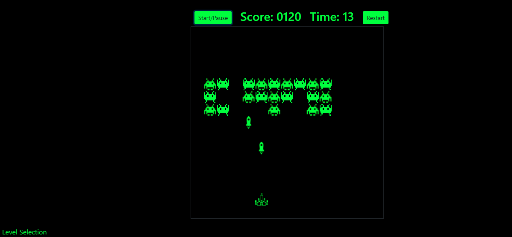

  

## About

I am a junior fullstack developer with a DevOps orientation, experienced in end-to-end development of Python/JavaScript web apps.
I was mentored to use best practices and clean code principles to produce high quality and maintainable code.

I get along great with people and love working in a team.
In my spare time I love hiking and I weave baskets.

## Top Languages and GitHub stats

 

## Skills

           

    

   

## I Am Currently Working On

[My Space-Invaders Project](https://space-invaders.avshi.net)
You are very welcome to read all about it at [The Project's README.md](https://github.com/AvshRLev/gamesproject#the-space-invaders-project-space_invader)

<!--
**AvshRLev/avshrlev** is a ✨ _special_ ✨ repository because its `README.md` (this file) appears on your GitHub profile.

Here are some ideas to get you started:

- 🔭 I’m currently working on ...
- 🌱 I’m currently learning ...
- 👯 I’m looking to collaborate on ...
- 🤔 I’m looking for help with ...
- 💬 Ask me about ...
- 📫 How to reach me: ...
- 😄 Pronouns: ...
- ⚡ Fun fact: ...
-->
